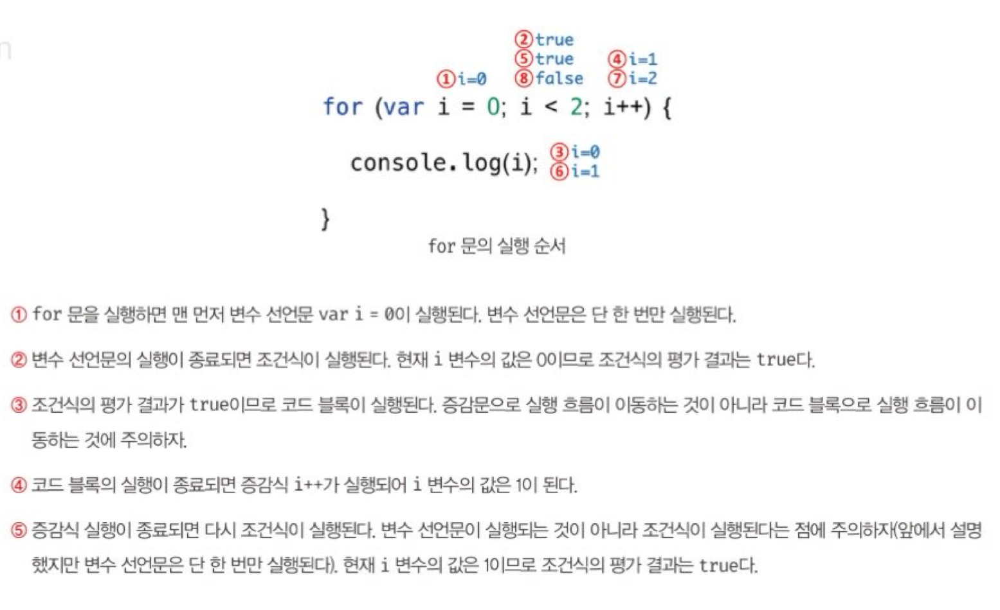
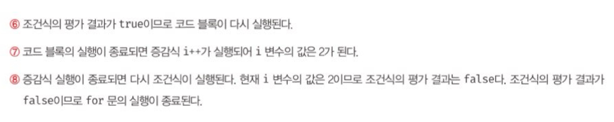

# 🌵08장 제어문

### [ 제어문 ]

- 조건에 따라 코드 블록을 실행(조건문)하거나 반복 실행(반복문)할 때 사용
- 코드의 실행 흐름을 인위적으로 제어
- 가독성을 해치는 단점

## 8.1 블록문

- 0개 이상의 문을 중괄호로 묶은 것
- 코드 블록 = 블록 = 블록문
- 블록문은 하나의 실행 단위로 취급
- 끝에 세미콜론을 붙이지 않는다.

## 8.2 조건문

- 불리언 값으로 평가될 수 있는 표현식

### 8.2.1 [ if...else문 ]

- if문의 조건식은 불리언 값으로 평가 되어야 함
- 아닌 값으로 평가되면 암묵적으로 불리언 값으로 강제 변환
- 표현식이 아닌 문 => 값처럼 사용할 수 없다.

> - 조건에 따라 단순한 값을 결정하여 변수에 할당하는 경우 => 삼항 조건 연산자
> - 조건에 다라 실행해야 할 내용이 복잡하여 여러 줄의 문이 필요 => if...else문

### 8.2.2 switch문

- 주어진 표현식을 평가하여 그 값과 일치하는 표현식을 갖는 case문으로 실행 흐름을 옮김
- case문은 상황을 의미하는 표현식을 지정하고 콜론으로 마침
- 표현식과 일치하는 case문이 없다면 실행 순서는 default문으로 이동
- default문은 선택사항
- 폴스루 fall through : break문을 사용하지 않아 switch문을 빠져나가지 못하고 다음 case문과 default문을 실행한 것
- default문에는 break문 생략

> - if...else문 : 조건식은 불리언 값
> - switch문 : 표현식은 문자열이나 숫자 값

## 8.3 반복문

- 조건식의 평가 결과가 참인 경우 코드 블록 실행

### 8.3.1 [ for문 ]

**for문의 실행순서**

### 8.3.2 [ while 문 ]

- 주어진 조건식의 평가 결과가 참이면 코드 블록을 계속해서 반복 실행

> - for문 : 반복 횟수가 명확할 때 주로 사용
> - while문 : 반복 횟수가 불명확할 때 주로 사용

### 8.3.3 [ do...while문 ]

- 코드 블록을 먼저 실행하고 조건식 평가
- 코드 블록은 무조건 한 번 이상 실행

## 8.4 break 문

- 레이블 문, 반복문(for, for...in, for...of, while, do... while) 또는 switch문의 코드 블록을 탈출
- 다른 곳에서는 문법 에러 발생

> 레이블 문
>
> - 식별자가 붙은 문
> - 프로그램의 실행 순서를 제어하는 데 사용
> - switch문의 case문, default문
> - 레이블 문을 탈출하려면 break 문에 레이블 식별자 지정
> - 일반적으로 권장하지 않음

## 8.5 continue 문

- 반복문의 코드 블록 실행을 현 지점에서 중단하고 반복문의 증감식으로 실행 흐름을 이동시킴
